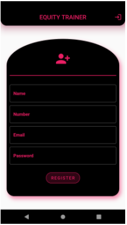
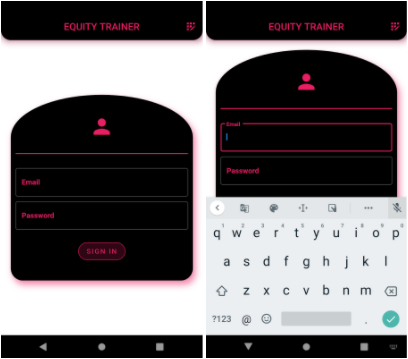
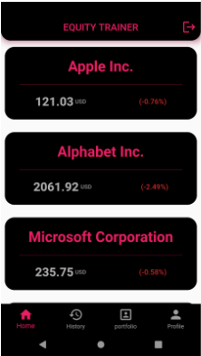
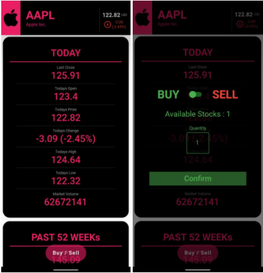
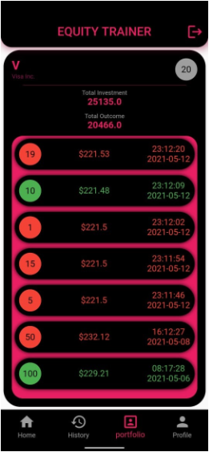
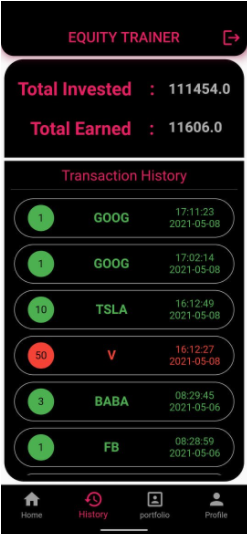
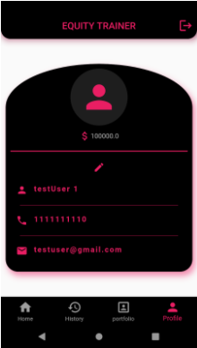

# Equity Trainer

A Flutter based Application for trying out Equity Exchange with tocken money.
back-end of the applicaiton is managed on firebase, so this app has real time data-management.

## Installation

Flutter SDK is needed to run the project.
- [Click Here](https://flutter.dev/docs/get-started/install) to see the installation steps for the flutter.

## Getting Started

Users can register the on the application with Email Id and Password with the name and number(Not necessarily valid)

### Register Screen

  

Or if already created one then just Log-In into the application.

### Login Screen

  

Inside the the home page we have several different stocks tiles with their name and cuurent prize, etc.

### Home Screen

  

here, to see more information about stock, we can click on the individual stock tile

### Stock Details Screen

  

to Sell or Buy stocks we can click on the sell/Buy button

we can also see the portfolio from the home screen by clicking on portfolio button

### Portfolio Screen

  

and, to see the profile screen we can click on the profile button

### TransactionHistory Screen

  

and, to see the Transaction History screen we can click on the History button

### Profile Screen

  

